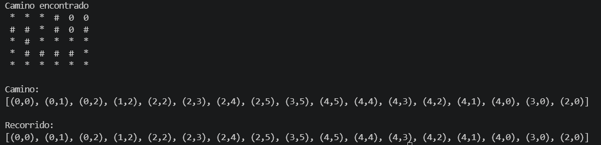

## Practica Programacion Dinámica

Nombre: Gabriel Cuenca

Fecha: 15/07/2026

### Algoritmo implementado.

Tecnica: BackTracking.

Descripción: La solución emplea backtracking para trazar una ruta entre el punto de partida y la meta. El proceso evalúa el avance en cuatro sentidos (derecha, abajo, izquierda y arriba). Al detectar un camino sin salida, el sistema deshace el último movimiento (retroceso) y continúa explorando rutas alternativas hasta hallar la salida.

### Control de Posiciones Visitadas:

Estructura: LinkedHashSet.

Descripcion: Se emplea esta colección para llevar un registro de las coordenadas ya evaluadas. Su uso garantiza que el algoritmo no entre en bucles al revisar la misma posición múltiples veces, conservando de forma exacta el orden cronológico de la exploración.

### Almacenamiento de la Ruta

Estructura: ArrayList.

Descripcion: La gestión del camino actual se realiza mediante un ArrayList. Esta lista facilita la inserción y extracción de elementos que requiere la recursividad. Al concluir la ejecución, la estructura contiene de manera exclusiva las celdas que conforman la trayectoria correcta hacia el destino.

### Salida de consola:

